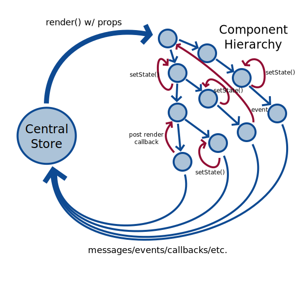

# React modern ecosystem survey 2017

    * React flow
    * React components
    * HOCs, recompose library
    * Redux flow
    * Redux parts - constants, action creators, reducers, middleware, store/state, selectors (reselect)
    * Epics - rxjs middleware
    * Structuring your project - redux ducks
    
## Few words about React
It's just a view layer for your applications. React allows you to sync up your data with DOM.
Most tools have very simple API - learn JS programming, not tools.
        
## React flow 
Mostly one-way data flow. Data passing by props from component to component. 
Component could have internal state and invokes render() function when state/props changes.


````
import React from 'react'
const AwesomeLabel = props => <label className="my-label-style">{props.labelText}</label>
````


