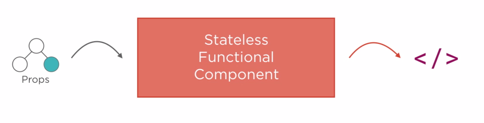
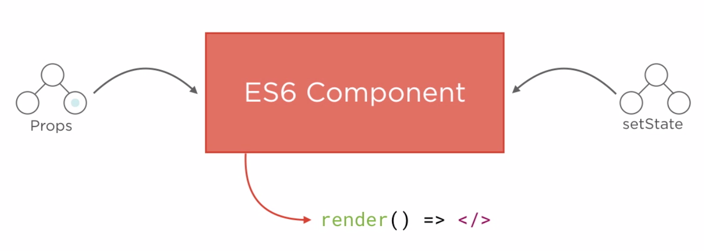
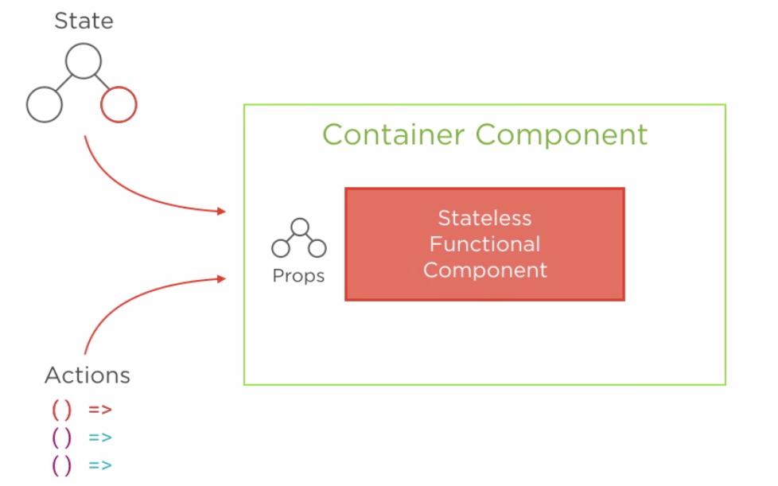
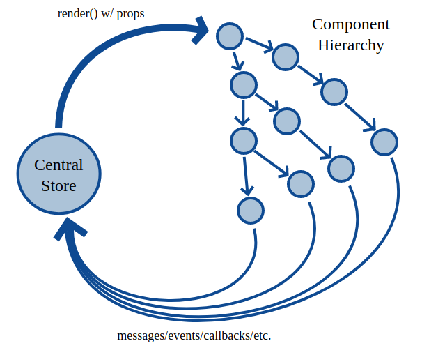
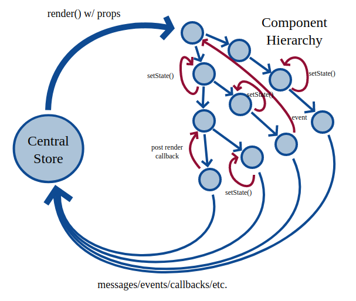

# React modern ecosystem survey 2017

    * React components
    * React flow
    * HOCs, recompose library
    * Redux flow
    * Redux parts - constants, action creators, reducers, middleware, store/state, selectors (reselect)
    * Epics - rxjs middleware
    * Structuring your project - redux ducks
    
## Few words about React
It's just a view layer for your applications. React allows you to sync up your data with DOM.
Most tools have very simple API - learn JS programming, not tools.

## React components
Stateless component - pure function. Render data from props. Use it for representation purpose.

````
import React from 'react'
const AwesomeLabel = props => <label className="my-label-style">{props.labelText}</label>
````
Stateful component - class, extends React.Component. Has its own state. Updates state itself.

```
import React, { PureComponent } from 'react'
class AwesomeInput extends PureComponent {
    state = { inputValue: '' }
    
    render() {         
            return(
                <input 
                    type="text"
                    onChange={event => this.setState({ inputValue: event.target.value })} 
                    value={this.state.inputValue}
                    />)
    }
}
```
Container component - wrapper component that passes props/state to multiple stateless components.

````
import React from 'react'
const AwesomeButton = ({ children, className, onClick, ...restProps }) => <button {...{ className, onClick }} ...restProps>{children}</button>

const AwesomeIconButton = props => 
    <AwesomeButton className="btn" onClick={props.onClick} onHover={props.onHover}>
        <span>
            <i classname="fa"/>
        </span>
        {props.caption}
    </AwesomeButton>
````       
## React flow 
Mostly one-way data flow. Data passing by props from component to component. 
Component could have internal state and invokes render() function when state/props changed.



When we call setState or have intra-component communication, the diagram is not so pretty. The data flow loops back on itself, each prop no longer has a single origin. The application is fundamentally more complicated — whorls of confusion instead of a simple cycle. Components can re-render needlessly, and property thrashing is possible.


````
import React, { PureComponent } from 'react'
import PropTypes from 'prop-types'
class AwesomeInput {
    static propTypes = {
        placeholder: PropTypes.string.isRequired,
        setParentComponentValueCallback: PropTypes.func.isRequired,
        isMountedCallback: PropTypes.func.isRequired,
    }
    
    state = { inputValue: '' }
    
    handleChange = event => {
        this.setState({ inputValue: event.target.value },
            () => this.props.setParentComponentValueCallback(event.target.value)
        );
    }
        
    render() {
        this.props.isMountedCallback();
        return(
            <input 
                type="text"
                placeholder={this.props.placeholder}
                value={this.state.inputValue}
                onChange={this.handleChange}                
            />)
    }
}
````
## HOCs, recompose library
Higher Order Components is a great Pattern - allow you to reuse components, state abstraction and manipulation, simplify testing. A Higher Order Component is just a React Component that wraps another one.
Recompose is a React utility belt for function components and higher-order components. Think of it like lodash for React.
```` 
import React, { PureComponent } from 'react';
import PropTypes from 'prop-types';
import { bindActionCreators } from 'redux';
import { connect } from 'react-redux';
import { lifecycle } from 'recompose';

import PTPanel from '../../presentational/PTPanel/PTPanel';
import PatientsChart from '../../containers/PatientsChart/PatientsChart';
import patientsSelector from './selectors';
import { fetchPatientsRequest } from '../../../ducks/feth-patients.duck';
import { patientsDepartments, patientsAges } from '../../../config/patients.constants';

const fetchPatientsOnMount = ({
  componentDidMount() {
    this.props.actions.fetchPatientsRequest()
  },
});

const mapDispatchToProps = dispatch => ({ actions: bindActionCreators({ fetchPatientsRequest }, dispatch) });

@connect(patientsSelector, mapDispatchToProps)
@lifecycle(fetchPatientsOnMount)
export default class SystemDashboard extends PureComponent {
  static propTypes = {
    patientsByAge: PropTypes.arrayOf(PropTypes.array).isRequired,
    patientsByDepartment: PropTypes.arrayOf(PropTypes.array).isRequired,
  };

  render() {
    const { patientsByAge } = this.props;

    return (
      <section className="page-wrapper">
            <PTPanel header={<h3 className="panel-title"><i className="fa fa-bar-chart" /> Patients By Age</h3>}>
              <PatientsChart
                title="Patients By Age"
                patients={patientsByAge}                
              />
            </PTPanel>
      </section>)
  }
}
````