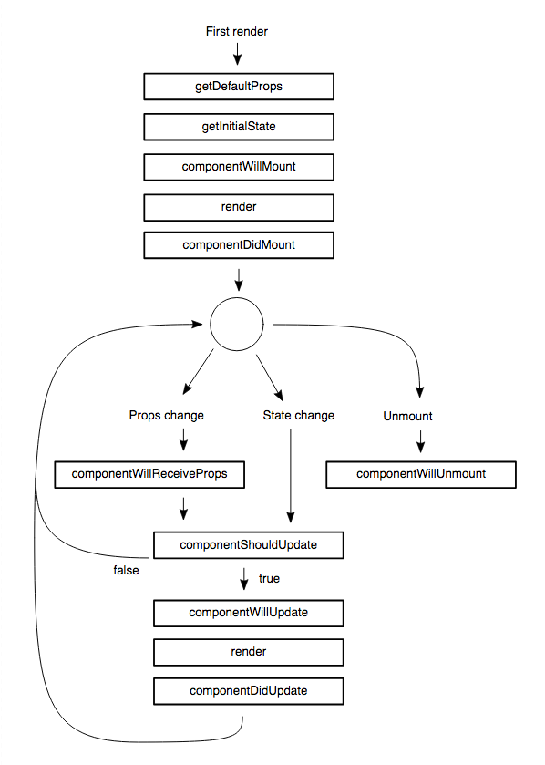
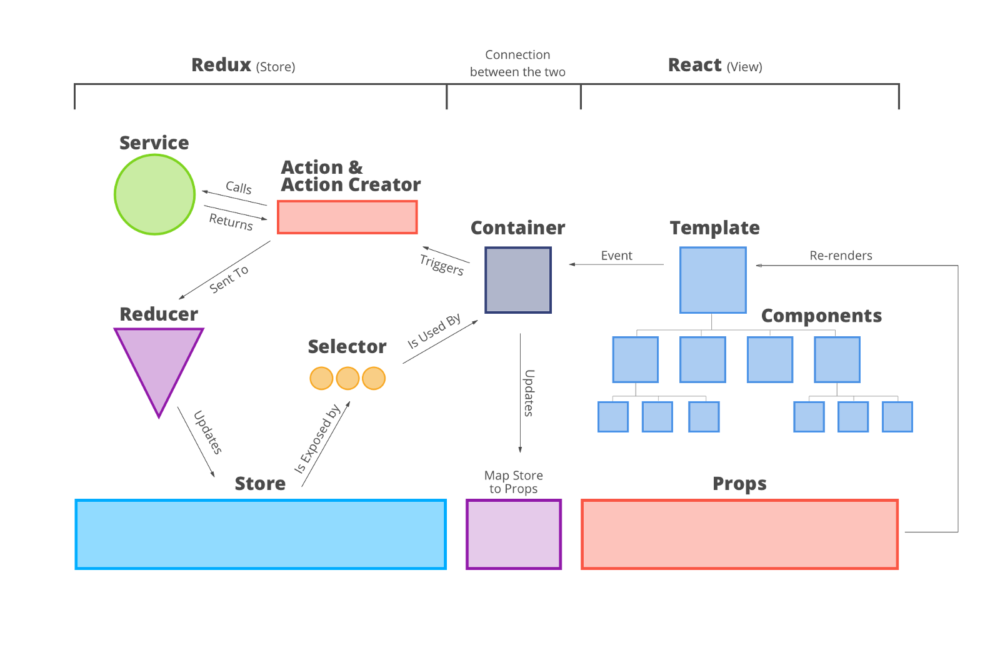

# Redux with React best practices

    * React recall
    * Ract-Redux interaction recall
    * Where do we put business logic?
    * Redux Architecture Guidelines
    
## Let's recall React flow



## Let's recall Redux + React flow

### Simple:


### In practice:


## Where do we put business logic?

   ### Action creators
   
   Advantages:
    
    * simple and focused code, not much additional ceremony
    
   Limitations:
    
    * No easy way to cancel pending requests or only take the latest if multiple requests are made
    * No access to the global state to make decisions with. You only have access to whatever props or component state that you pass in. This might mean requiring extra data to be provided to a component that normally wouldn’t be needed for rendering but is solely needed for the business logic. Any time the business logic changes it might require new additional data to be passed down possibly affecting many components in the process.
    * No interception. I also have no easy way to create business logic that applies across many actions, so if I wanted to augment all actions to have a timestamp or unique ID, I’d have to include a call to that code in all action creators.
    * Testing components and fat action creators may require running the code (possibly mocked).
    
   ### Reducers
   
   Advantages:
   
       *   It’s easy to perform some logic inside of the reducer
       *   Business logic can choose whether to apply the state change
   
   Disadvantages:
       
       *   Conflates the business logic with the state updates
       *   Only synchronous tasks
       *   No ability to replace or dispatch a different error action
       *   Access is limited to partial state if reducers are being combined
       *   No global interception of actions
       
   ### Sagas
   
   Advantages:
    
        *    ES6 generators allow for limiting and cancellation
        *    Action creators now only dispatch simple objects so testing components is easy. Generator code can be tested independently.
        *    Asynchronous orchestration looks like synchronous code via yield
    
   Limitations:
    
        *   ES6 generators are not commonly well understood by many developers
        *   Fair amount of code to setup watch loops and implement cancellation
        *   No interception — sagas always run after actions have been given to the reducers
   
## Redux Architecture Guidelines

### Plan your state shape

    * How will it store multiple resources from an API 
        * loading states (isFetching etc)
        * user info
        * user account
        * items
            * markets
            * icos
        * UI
            * spinners
            * forms
            * popups
            * notifications
    * Does it feel consistent and predictable? Could another team member easily work with it?
    * Is it easy to access data within it? Does it nest properties unnecessarily?
    * Is it serializable? Could it easily be stored away in localstorage or in a database?
    * Are there any properties you could pull from the URL instead of in the state?
    * Is there any duplicated data in here? If so, is that really needed?
    * Avoid nesting state objects
    * Storing only raw data in the state
    * Prefer Redux state over React state
    
### Standardize action payloads (FSA)
    
    * type
    * payload
    * error
    * meta
    
### Split reducer logic and combine reducers and actions/action creators/middleware to ducks, combine reducers hierarchically

Example:

State
````
state: {
    fetching: {
        transactionPending: false,
        wsFetching: false, 
    }
}
````

Actions
````
    TRANSACTION_PENDING_START
    TRANSACTION_PENDING_SUCCESS
    TRANSACTION_PENDING_FAIL
    
    WS_FETCHING_START
    WS_FETCHING_SUCCESS
    WS_FETCHING_FAIL
    
    //action creators will produce transactionPendingStart actions etc
````

Reducers
````

const initialTransactionPendingState = false;

export default function reducer(state = initialTransactionPendingState, ({ type, payload })) { 
    switch(type) {
        case TRANSACTION_PENDING_START:
            return true;
        case TRANSACTION_PENDING_SUCCESS:
            return false;
        case TRANSACTION_PENDING_FAIL:
            return false;   
        default:
            return state; 
    }
}

const initialWsFetchingState = false;

export default function reducer(state = initialWsFetchingState, ({ type, payload })) { 
    switch(type) {
        case WS_FETCHING_START:
            return true;
        case WS_FETCHING_SUCCESS:
            return false;
        case WS_FETCHING_FAIL:
            return false;
        default:
            return state;            
    }
}  
    
````

Combine reducers
````
import { combineReducers } from 'redux';

import transactionReducer from './transaction-pending.duck'
import wsFetchingReducer from './ws-fetching.duck'

const fetchingReducer = combineReducers({
    transactionPending: transactionReducer,
    wsFetching: wsFetchingReducer,
})

export default fetchingReducer
````

index.js
````
import { combineReducers, createStore } from 'redux';

import fetchingReducer from './fetching.duck'

const rootReducer = combineReducers({
    fetching: fetchingReducer
})

const store = createStore(rootReducer);
````
   
### Presentational and Container Components

<table>
    <thead>
        <tr>
            <th></th>
            <th scope="col" style="text-align:left">Presentational Components</th>
            <th scope="col" style="text-align:left">Container Components</th>
        </tr>
    </thead>
    <tbody>
        <tr>
          <th scope="row" style="text-align:right">Purpose</th>
          <td>How things look (markup, styles)</td>
          <td>How things work (data fetching, state updates)</td>
        </tr>
        <tr>
          <th scope="row" style="text-align:right">Aware of Redux</th>
          <td>No</th>
          <td>Yes</th>
        </tr>
        <tr>
          <th scope="row" style="text-align:right">To read data</th>
          <td>Read data from props</td>
          <td>Subscribe to Redux state</td>
        </tr>
        <tr>
          <th scope="row" style="text-align:right">To change data</th>
          <td>Invoke callbacks from props</td>
          <td>Dispatch Redux actions</td>
        </tr>
        <tr>
          <th scope="row" style="text-align:right">Are written</th>
          <td>By hand</td>
          <td>Usually generated by React Redux</td>
        </tr>
    </tbody>
</table>

